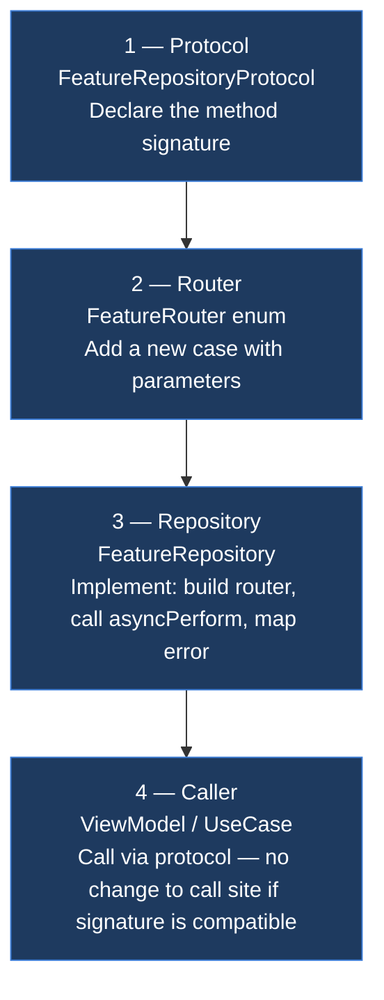
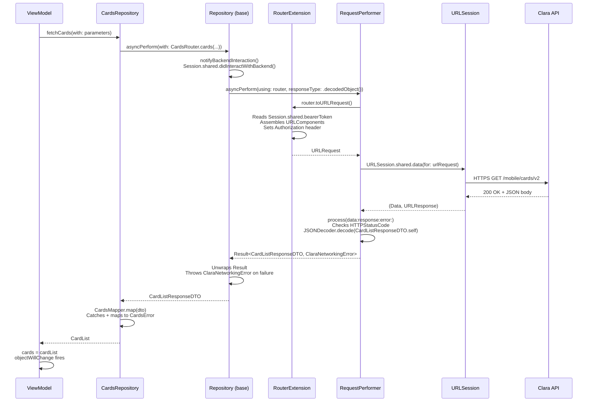
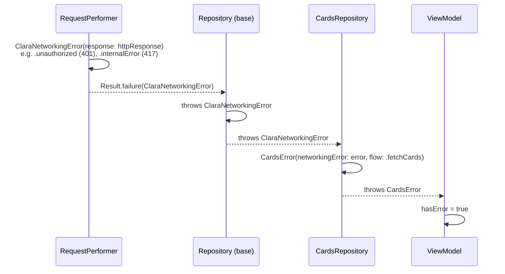

# Core/Networking — ClaraNetworking

---

## Overview

Backend communication is handled through an internal Swift package called `ClaraNetworking`. It provides all the infrastructure for making HTTP requests and WebSocket connections. Feature modules never interact with `URLSession` directly — all networking goes through this package.

---

## Protocols

The backend is accessed via two protocols:

**REST — `Router`**
Defines everything needed to construct an HTTP request: scheme, host, path, method, headers, body, and query parameters. Each domain defines its endpoints as an enum conforming to `Router`.

**Real-time — `WebSocketRouter`**
Defines everything needed to open a WebSocket connection using STOMP framing: host, path, destination topic, auth token, and headers. Used for real-time data streams.

---

## Components

| File | Responsibility |
|---|---|
| `Router` | Protocol — defines an HTTP endpoint |
| `WebSocketRouter` | Protocol — defines a WebSocket endpoint |
| `RequestPerformer` | Executes REST requests via `URLSession` |
| `WebSocketPerformer` | Manages WebSocket connections with STOMP framing |
| `ExpectedResponseType` | Tells the performer how to handle the response — decode an object or expect a successful status |
| `ClaraNetworkingError` | Maps HTTP status codes and `URLError` to typed domain errors |
| `HTTPStatusCode` | Maps raw status codes to typed cases |
| `BackgroundService` | Handles background multipart file uploads |

---

## Request Flow

```
Feature Code
└── Repository (protocol)
        └── Repository (base class)
                └── RequestPerformer
                            └── URLSession
                                    └── Clara API
```

1. Feature code calls a method on a `Repository` protocol
2. The concrete repository builds a `Router` for the specific endpoint
3. Passes it to `RequestPerformer` which executes the `URLSession` call
4. Response is decoded into a typed model and returned via `async/await`
5. Networking errors are mapped to `ClaraNetworkingError`

---

## Adding a New Endpoint

Four touch points, always in this order:



### Step-by-step

**Step 1 — Protocol** (`FeatureRepositoryProtocol.swift`)

Declare what the feature needs. Domain types only — no networking types leak through.

```swift
protocol CardsRepositoryProtocol {
    func fetchCards(with parameters: CardListParameters) async throws(CardsError) -> CardList
}
```

**Step 2 — Router** (`CardsRouter.swift`)

Add a case. The router owns: `urlPath`, `httpMethod`, `parameters` (query string), `body` (JSON encoded). `urlScheme`, `urlHost`, `headers`, and `authorization` come for free from `RouterExtension`.

```swift
enum CardsRouter: Router {
    case cards(parameters: CardListParameters)

    var urlPath: String {
        switch self {
        case .cards: return "/mobile/cards/v2"
        }
    }

    var httpMethod: HTTPMethod {
        switch self {
        case .cards: return .get
        }
    }

    var parameters: [String: Any]? {
        switch self {
        case .cards(let p): return p.dictionary
        }
    }
}
```

**Step 3 — Repository** (`CardsRepository.swift`)

Build the router case, call `asyncPerform`, map `ClaraNetworkingError` to your domain error.

```swift
final class CardsRepository: Repository, CardsRepositoryProtocol {
    func fetchCards(with parameters: CardListParameters) async throws(CardsError) -> CardList {
        do {
            let dto: CardListResponseDTO = try await asyncPerform(
                with: CardsRouter.cards(parameters: parameters),
                responseType: .decodedObject()
            )
            return CardsMapper.map(dto)
        } catch {
            guard let networkingError = error as? ClaraNetworkingError else { throw .networkingUnknown }
            throw CardsError(networkingError: networkingError, flow: .fetchCards)
        }
    }
}
```

**Step 4 — Caller**

The ViewModel or UseCase calls through the protocol. It never knows which router or concrete repository is used.

```swift
final class CardsViewModel: ObservableObject {
    @Inject(\.cardsRepository) private var repository

    func loadCards() async {
        do {
            cards = try await repository.fetchCards(with: .default)
        } catch {
            hasError = true
        }
    }
}
```

---

## Request Sequence

What happens at runtime from the moment a ViewModel calls a repository method to the moment it gets data back.



### Error path

When the API returns a non-2xx status, the same sequence diverges at `RequestPerformer.process`:



---

## Defining an Endpoint

Each domain defines its endpoints as a Swift enum conforming to `Router`:

```swift
enum CardsRouter: Router {
    case fetchCards(parameters: CardListParameters)
    case cardDetails(cardId: String)
    case updateCardStatus(parameters: UpdateCardStatusParameters)

    var urlPath: String {
        switch self {
        case .fetchCards:           return "/cards"
        case .cardDetails(let id):  return "/cards/\(id)"
        case .updateCardStatus:     return "/cards/status"
        }
    }

    var httpMethod: HTTPMethod {
        switch self {
        case .fetchCards, .cardDetails: return .get
        case .updateCardStatus:         return .put
        }
    }
}
```

---

## Calling an Endpoint

Repositories call endpoints using `async/await`:

```swift
// Decode a response object
let cards: CardListResponseDTO = try await asyncPerform(
    with: CardsRouter.fetchCards(parameters: parameters),
    responseType: .decodedObject()
)

// Expect a successful response with no body
let _: Bool = try await asyncPerform(
    with: CardsRouter.updateCardStatus(parameters: parameters),
    responseType: .successfulResponse
)
```

---

## Error Handling

`ClaraNetworkingError` maps all transport and HTTP errors to typed cases:

| Error | Cause |
|---|---|
| `.internetConnection` | No network |
| `.unauthorized` | 401 — invalid or expired token |
| `.notAllowed` | 403 — insufficient permissions |
| `.resourceNotFound` | 404 |
| `.internalError(code:)` | 417 — business logic error with a code |
| `.serverError` | 500 |
| `.timeoutError` | 408 or request timeout |
| `.notDecodableResponse` | Response could not be parsed |
| `.serverTrust` | SSL certificate mismatch |

Domain repositories map `ClaraNetworkingError` to their own typed errors before returning to feature code.

---

## WebSocket Flow

```
Feature Code
└── Repository
        └── WebSocketRepository (base)
                └── WebSocketPerformer
                            └── URLSessionWebSocketTask
                                    └── STOMP handshake
                                            └── Topic subscription
                                                    └── AsyncThrowingStream<T>
```

Real-time data is consumed as an `AsyncThrowingStream` — feature code iterates over events as they arrive:

```swift
for try await update in repository.subscribeToCardUpdates() {
    handle(update)
}
```

---

## Authentication

All requests are authenticated automatically. A `Router` extension injects the bearer token from the current session into every request — feature code never handles auth headers manually.

---

## External Hosts

| Host | Purpose |
|---|---|
| `Constants.Networking.host` | Main Clara API (REST + WebSocket) |

---

## Improvements

| Issue | Goal |
|---|---|
| `RequestPerformer` has no protocol | Extract `RequestPerforming` to enable mocking in tests |
| No central serialisation | Introduce `NetworkCoder` for consistent encoding and decoding |
| Callback-based methods still exist | Migrate all remaining `@escaping` completions to `async/await` |
