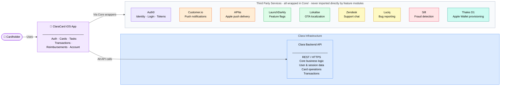
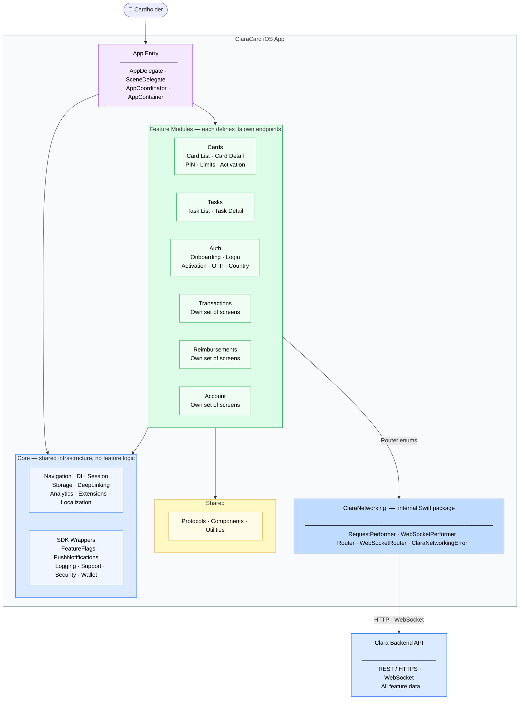
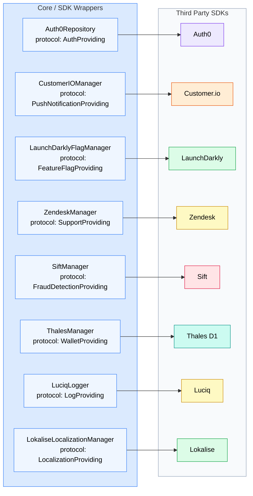

# ClaraCard C4 Diagrams

## Level 1 · System Context

Who interacts with ClaraCard and what external systems it depends on.

### External systems

| Category | System | Description |
|---|---|---|
| **Backend** | Clara Backend API | Core business logic and data layer. All feature modules reach the backend exclusively through `Core/Networking`. |
| **Identity** | Auth0 | Authentication provider. Handles login, passwordless flows, token issuance, and refresh. The app never stores credentials — Auth0 owns the full identity lifecycle. |
| **Notifications** | Customer.io | Manages push notification delivery and tracks device attributes. The backend sends events to Customer.io which triggers pushes to the device via APNs. |
| **Notifications** | APNs | Apple's push delivery infrastructure. The app receives all push notifications through APNs. Customer.io is the upstream system that sends to APNs. |
| **Feature Control** | LaunchDarkly | Feature flag and remote configuration service. Allows features to be toggled per country, per user segment, or for internal employees without a new app release. |
| **Feature Control** | Lokalise | Over-the-air localization. Serves updated translation strings at launch so copy changes ship without going through App Store review. |
| **Support & Ops** | Zendesk | In-app customer support chat. Configured with a per-country channel key so support queues are separated by market. Authenticated via a JWT from the Clara backend. |
| **Support & Ops** | Luciq | In-app bug reporting and QA feedback tool. Users and testers shake the device to capture a screenshot, device info, and recent network logs and submit a report. |
| **Security** | Sift | Fraud detection SDK. Collects device signals silently in the background to build a risk score for the current session. Used to detect suspicious card activity and account takeover. |
| **Wallet** | Thales D1 | Digital card provisioning SDK. Handles the cryptographic flow that provisions a Clara card as a trusted payment credential in Apple Wallet. Configured per country and environment. |

---

## Level 2 · Container

### 2a · App layers and feature modules

How the app is structured internally — entry point, core infrastructure, shared utilities, and feature modules. Feature modules reach the backend exclusively through `ClaraNetworking`; no module calls the API directly.

---

### 2b · Core SDK wrappers

Every third party SDK has exactly one wrapper in Core. Feature modules never import an SDK directly they depend on the wrapper protocol via DI.

