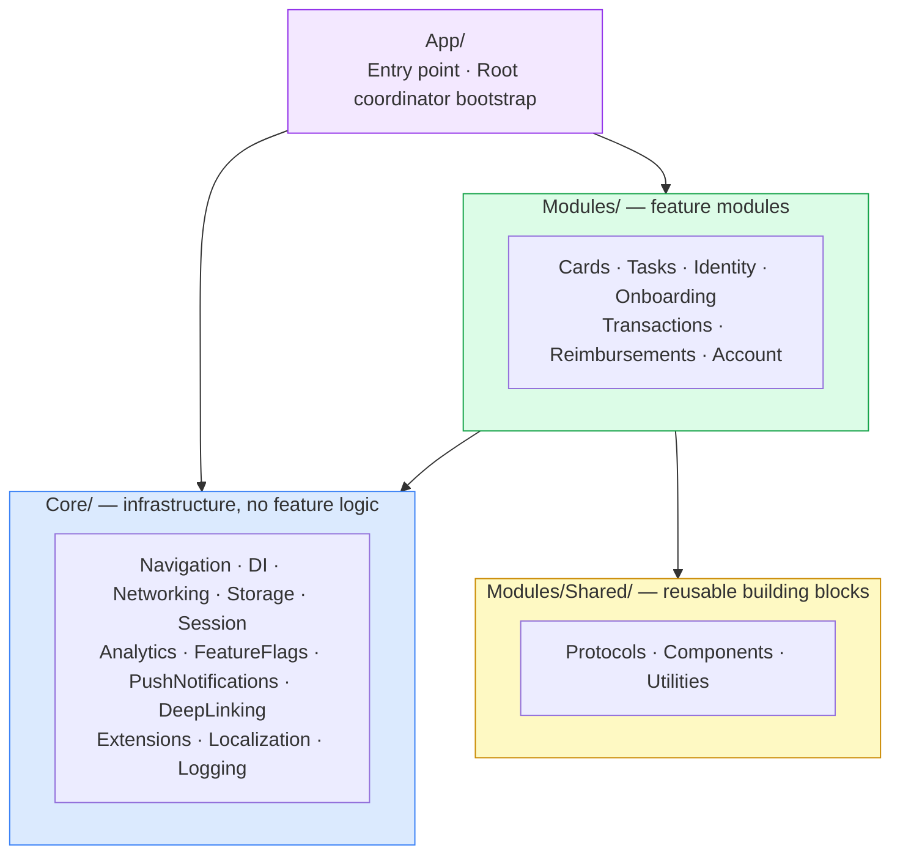
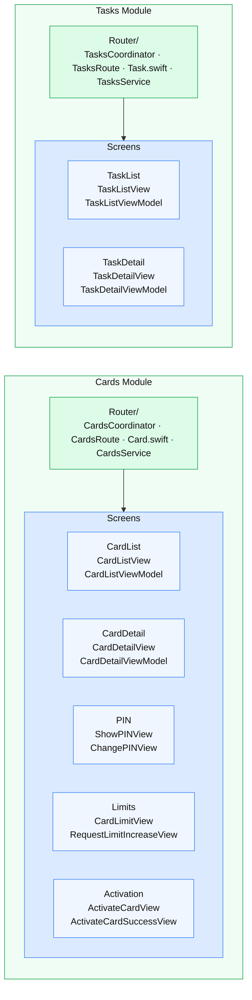
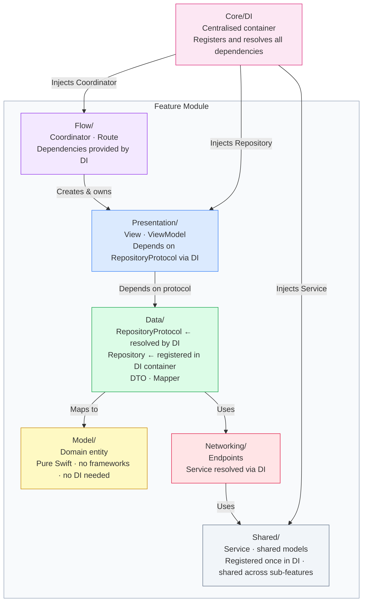

# ClaraCard  Folder Structure

Every feature module owns its full vertical slice: screens, view models, models, repositories, and coordinator.
No module reaches into another module's internals.

---

## Modules

| Module | Screens | Coordinator |
|---|---|---|
| `Auth` | Onboarding · Login · UserActivation · CountrySelection · OTPChallenge | `AuthCoordinator` |
| `Cards` | CardList · CardDetail · PIN · Limits · Activation | `CardsCoordinator` |
| `Transactions` | TransactionList · TransactionDetail · Filters · Labels · InvoiceSuggestions · ReportTransaction · SuspiciousTransaction | `TransactionsCoordinator` |
| `Reimbursements` | ExpenseList · ExpenseDetail · ExpenseForm · BankAccount · Attachments | `ReimbursementsCoordinator` |
| `Account` | Profile · Security · Collections · Referrals · CompanySwitch | `AccountCoordinator` |
| `Tasks` | TaskList · TaskDetail | `TasksCoordinator` |

---

## 1 · App layers

---

## 2 · Feature modules

Each module owns its screens and is isolated from other modules.
The module boundary (coordinator + shared model) is separate from the screens it contains.

---

## 3 · Internal pattern every module follows

Dependencies flow in from `Core/DI` — no class creates its own dependencies.

**Key rules:**
- `Core/DI` is the only place dependencies are created never inside a class
- ViewModels depend on a `RepositoryProtocol`, never on a concrete `Repository` this makes them independently testable
- Dependencies are provided by the DI container, not created or looked up by the class that needs them
- `Service` (network client) is registered once in DI and shared across all repositories within the module
