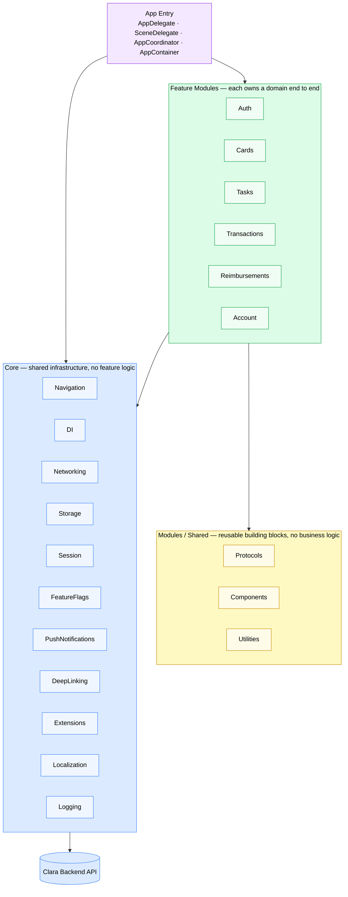

# ClaraCard  Module Architecture

How the app is layered and how feature modules are structured internally.
Use this to onboard engineers and align on where new code belongs.

---

## 1 · Core vs Modules

**Core** holds everything that is not specific to a feature networking, DI, navigation, session, and all third-party SDK wrappers. No feature logic lives here.

**Modules / Shared** holds protocols, UI components, and utilities that are used by two or more modules but do not belong to any one of them.

**Feature Modules** each own a domain end to end from the screen down to the API call. No module imports from another module.

---

## 2 · Layer responsibilities

| Layer | Lives in | Responsibility |
|---|---|---|
| `Flow/` | `Module/Shared/Flow/` | Coordinator owns navigation. Route defines all destinations within the module. |
| `Presentation/` | `SubFeature/Presentation/` | View and ViewModel only. No networking, no direct data access. |
| `Model/` | `SubFeature/Model/` | Domain entity. Pure Swift, no frameworks. Shared models move to `Module/Shared/Model/`. |
| `Data/` | `SubFeature/Data/` | RepositoryProtocol (contract), Repository (implementation), DTO (API shape, never exposed outside Data), Mapper (DTO → Model). |
| `Networking/` | `SubFeature/Networking/` | One endpoint file per API call. The shared service lives at `Module/Shared/Networking/`. |
