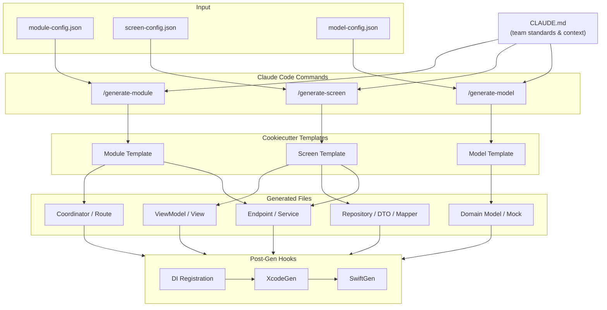

# iOS AI Enablement Project

## Project Summary

This project is a CLI-driven code generation system for iOS. It combines Claude Code commands, Cookiecutter templates, and JSON configuration files to scaffold modules, screens, and domain models consistently across the team. An engineer describes what they want to build in a structured config file, runs a command in Claude Code, and receives a complete, wired file set that matches the team's established architecture — ready to fill in with business logic.

---

## Business Value

### Speed

Scaffolding a new screen involves file creation, DI wiring, XcodeGen, and fixing anything missed along the way. Across a feature with several screens, that is meaningful setup time before a single line of product code is written.


### AI-Native Workflow

This project is not a code generator bolted onto existing tooling. It is built around Claude Code as the primary interface, which means the generation workflow is conversational and context-aware from the start.

CLAUDE.md gives Claude persistent knowledge of the team's architecture. Engineers do not explain patterns from scratch on every run  they describe what they want to build and the system already knows what that should look like in this codebase. Over time, as CLAUDE.md evolves with new decisions and standards, every command benefits automatically.

This is the beginning of a broader shift: moving from engineers manually navigating architecture decisions to an AI-assisted workflow where the standards are encoded, enforced, and applied at the moment of creation.

---

## Problem It Solves

Boilerplate has no product value. Creating files, wiring DI, and running XcodeGen do not move a feature forward  they are prerequisites before the actual work can start. On a small team, that setup cost compounds quickly across every new screen and module.

The goal of this system is to eliminate that cost entirely so engineers can go straight to implementing business logic. The scaffolding is not the work; it should not require engineering time.

Without this system, adding a new screen or module means:

- Manually creating 6–8 files per screen, copying and adjusting boilerplate from the nearest example
- Wiring dependencies by hand into the DI container, which is easy to miss and hard to catch until runtime
- Inconsistent layer structure across modules — some screens have a Repository, some don't; some ViewModels use `@Inject`, some grab `.shared`
- Missing mock implementations that block test authors from the start
- XcodeGen and SwiftGen steps that are forgotten or run out of order

With this system, all of that is generated in one command. The engineer's first meaningful line of code is business logic, not file creation.

---

## Delivery Phases

The system is delivered in three phases, each building on the previous. Each phase produces working, usable tooling — there is no big-bang release.

### Phase 1 — Model Generation

**Goal:** Generate domain models, DTOs, mappers, and mocks from a JSON config.

This is the smallest, most self-contained artifact in the architecture. No DI wiring, no coordinator, no XcodeGen changes. Phase 1 validates the full pipeline — JSON config → Cookiecutter template → generated files — at the lowest possible risk. Mistakes are cheap to catch and fix here.

**Deliverables:** `/generate-model` command, model Cookiecutter template, `model-config.json` schema, model proposal status lifecycle enforced by Claude CLI.

---

### Phase 2 — Module Generation

**Goal:** Generate a full feature module — coordinator, route, shared model layer, service, and DI registration stub.

With models proven in Phase 1, the module template can reference the model layer as a stable primitive. This phase also introduces post-gen hooks (DI registration, XcodeGen) and the `patch` action for shared files like route enums and the DI container. The `patch` behaviour is the highest-risk part of the system and should be spiked before full implementation begins.

**Deliverables:** `/generate-module` command, module Cookiecutter template, `module-config.json` schema, post-gen hooks for DI and XcodeGen.

---

### Phase 3 — Screen Generation

**Goal:** Generate a complete screen inside an existing module — ViewModel, View, Repository, DTO, Mapper, and Endpoint.

Screens are the most complex artifact and depend on both models and modules being stable. Delivering this last means the template can reference proven primitives and the engineer already trusts the output of the earlier phases. The `action` field (`create`, `skip`, `patch`) is fully exercised here across all layers.

**Deliverables:** `/generate-screen` command, screen Cookiecutter template, `screen-config.json` schema, full `action` field support across all layers.

---

## Core Concepts

### JSON-Driven Configuration

Three config types  module, screen, and model describe the shape of what gets generated. The config declares the name, layers, dependencies, and behaviors without requiring the engineer to know which files to create. Keeping the intent in JSON separates the *what* from the *how*, makes config reviewable in PRs, and allows the same config to be regenerated later without clobbering custom code.

### Claude Code Commands

Three commands are available directly inside a Claude Code session:

- `/generate-module`  scaffolds a full feature module with its coordinator, route, shared model, and service layers
- `/generate-screen`  scaffolds a single screen inside an existing module (ViewModel, View, Repository, DTO, Mapper, Endpoint)
- `/generate-model` scaffolds a domain model with its mock, DTO, and mapper

These commands read the JSON config, invoke the appropriate Cookiecutter template, and run post-generation hooks. They are the single entry point for all generation work.

### Cookiecutter Templates

There is a single Cookiecutter template per artifact type. Each template is designed to be as generic as possible — it reflects the team's current architecture patterns and is updated whenever those patterns change. The template is the living definition of what a correct module, screen, or model looks like at any point in time.

### CLAUDE.md or Playbook acts as the Project Brain

`CLAUDE.md` is loaded automatically by Claude Code at the start of every session. It gives Claude the team's architecture standards, naming conventions, layer responsibilities, and active decisions as persistent context. This means commands do not need to be re-explained on each run Claude already knows what a `Repository`, a `Coordinator`, or an `@Inject` declaration should look like in this codebase.

### Post-Generation Hooks

After files are written, three hooks run automatically:

- **DI registration**  wires the new module's dependencies into the DI container
- **XcodeGen**  regenerates the Xcode project file so new files are included in the build

Hooks are the most error-prone part of manual scaffolding. Running them as part of generation means a generated feature compiles on the first try.

---

## Architecture Overview



---

## Command Overview

| Command | Input | What it generates | When to use it |
|---|---|---|---|
| `/generate-module` | `module-config.json` | Coordinator, Route, Shared model, Service, DI registration stub | Starting a brand-new feature domain (e.g. a new top-level module like `Reimbursements`) |
| `/generate-screen` | `screen-config.json` | ViewModel, View, Repository protocol + impl, DTO, Mapper, Endpoint | Adding a screen inside an existing module |
| `/generate-model` | `model-config.json` | Domain model, DTO, Mapper, Mock implementation | Adding or standardising a shared domain type |

---

## JSON Config Overview

### Module Config

Describes a new feature module — its name, the screens it contains, and whether a shared service layer should be generated.

```json
{
  "module": "Payments",
  "screens": ["PaymentList", "PaymentDetail"],
  "shared": {
    "model": true,
    "service": true,
    "flow": true
  }
}
```

### Screen Config

Describes a single screen — its layers, its dependencies, and the `action` to apply to each.

```json
{
  "screen": "PaymentDetail",
  "module": "Payments",
  "layers": ["Presentation", "Model", "Data", "Networking"],
  "dependencies": ["PaymentsService", "AnalyticsProviding"],
  "action": "create"
}
```

### Model Config

Describes a domain model — its name, whether to generate a DTO and mapper, and whether a mock is needed for tests.

```json
{
  "model": "Payment",
  "dto": true,
  "mapper": true,
  "mock": true
}
```

---

## What This Project Does NOT Do

- **Does not write business logic.** Generated files are stubs. ViewModels have the right structure and dependency declarations; the logic inside functions is left for the engineer.
- **Does not replace code review.** Generated code is subject to the same review standards as hand-written code. The reviewer checks that the config was correct and that any custom additions are sound.
- **Does not manage app state.** The generator produces files in the team's architectural pattern. It does not decide how state flows, how navigation is triggered, or how errors are handled.
- **Does not enforce runtime behaviour.** Post-gen hooks wire files into the build. They do not add runtime assertions, analytics events, or error handling.
- **Does not keep files in sync.** Once a file is generated and modified, the generator has no knowledge of those modifications. Re-running with `create` will fail; re-running with `skip` will leave it alone. There is no two-way sync.

---

## Glossary

| Term | Definition |
|---|---|
| **Module** | A top-level feature domain in the app (e.g. `Cards`, `Transactions`, `Reimbursements`). Contains one or more screens, a shared model layer, a service layer, and a coordinator. |
| **Screen** | A single navigable UI unit within a module (e.g. `CardDetail`). Follows a fixed internal structure: Presentation, Model, Data, Networking. |
| **Provider pattern** | A protocol-based abstraction over an external SDK or system capability (e.g. `FeatureFlagProviding`, `LogProviding`). Allows the concrete implementation to be swapped in tests or when the underlying SDK changes. |
| **DI** | Dependency Injection. The practice of declaring what a class needs (via `@Inject`) rather than constructing or reaching for it directly. Makes dependencies visible, testable, and swappable. |
| **Cookiecutter template** | A single generic template per artifact type (module, screen, model). Parameterised by the JSON config. Updated whenever the team's architecture patterns change — it is always the current definition of a correct artifact. |
| **CLAUDE.md** | A markdown file at the root of a repository that Claude Code loads automatically at the start of every session. It provides persistent context — team decisions, naming conventions, architectural rules — so commands do not need to re-establish that context each time. |
| **Post-gen hook** | A script that runs automatically after file generation completes. In this system: DI registration, XcodeGen (to include new files in the Xcode project), and SwiftGen (to regenerate typed asset/string references). |
| **Patch mode** | The behaviour triggered by `"action": "patch"`. The generator opens an existing file and appends a well-defined addition (e.g. a new enum case, a new DI registration) without rewriting the file. Safe to run on files that already contain custom code. |
